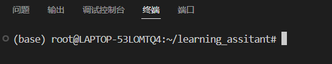

# Start
## Environment
1. 安装 conda 环境
~~~bash
mkdir -p ~/miniconda3
wget https://repo.anaconda.com/miniconda/Miniconda3-latest-Linux-x86_64.sh -O ~/miniconda3/miniconda.sh
bash ~/miniconda3/miniconda.sh -b -u -p ~/miniconda3
rm -rf ~/miniconda3/miniconda.sh
~~~
2. 初始化环境
~/miniconda3/bin/conda init bash
~/miniconda3/bin/conda init zsh
3. 新建 bash 查看是否安装成功

这里看到（base）表示安装成功
4. 创建新的 conda 虚拟环境
`conda env create -f learning_assistant.yml`

